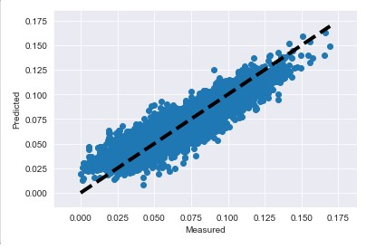

# *Real Estate Analysis for First-Time Home Buyers*
**Caleb Elgut - July 2020**

# Introduction

For this research project, I built a statistical model to create predictions of the price of houses in King County, Washington from various features of these houses. After creating the model and investigating the predictive results, I decided on four questions that are relevant to first-time home buyers in their serach: 
1. If you have a maximum budget of $500,000, what size of home should you consider?
1. What will the size of the neighbors' houses be if you have a budget of $500,000?
1. Does living on the waterfront impact the price?
1. Is there a portion of Kings County that would be best to move into with a budget of $500,000?

The data I used was pulled from Kaggle. It includes homes in King County, Washington sold between May 2014 and May 2015. Originally there were over 22,000 houses in our dataframe and there were 21 features including such obvious choices as square feet, number of bedrooms, number of bathrooms, and presence of a basement as well as some unexpected data such as the square feet of the 15 nearest neighbors' homes. 

The following Python packages were used in the analysis of my data:
- Pandas
- Numpy
- Matplotlib
- Seaborn
- Scikit-Learn
- StatsModels
- Warnings
- Datetime

# The Makings of the Model

The most important piece of this project is the creation of the statistical model that powered the predictions in my questions; therefore,  I will begin by explaining the birth pains that resulted from what I believe is a beautiful model with some underlying issues. We will see!

# Initial Examination and Observations

## The dataframe has 21 features, from these features came a few observations:

- The maximum number of bedrooms in a house is 33. 
- The maximum number of bathrooms is 8.
- The maximum square feet of a house is 13,540, the minimum is 370, but the median is 1910. I thought that was particularly fascinating.
- The minimum in the column for year renovated is 0, this denotes houses that were **not renovated**.
- Waterfront is a 1 or 0--you're either on the waterfront or you aren't. 
- There are null values to be taken care of in the columns for renovation year, square feet of the basement, the waterfront, and the 'view' category. 
  - On this note, the view category was quite strange. The dictionary that the data came with said that this category denoted whether or not the house had been viewed. However, the maximum value was 4 and I imagined that there exist houses in King County that have been viewed more than four times. 
- Since this project is meant for first-time buyers, I will be later focusing on a maximum budget of $500,000 (this will become relevant later after the model is complete and the visualizations are made). 
- Grade, condition, and square feet of home seem like good features to focus on however it will depend on which of these are better predictors of price and this information will come from our model. 

# The Baseline Model and the EDA

## A Word on Modeling:

For those unaware, a statistical model takes all of the information from a data frame and calculates each feature's effect on a target variable. For this project, the target variable is the price, and the features are the columns of interest. Initially, the models will be run with all other columns as predictors. However, as I examine each model's results, there will be edits, and certain features will be dropped as the data is continually processed, explored, and refined, as I seek to create a model that predicts with accuracy. 

## The Baseline Model

After the above analysis, before any preprocessing of data, I created a baseline model. This is the model upon which all future models will be built. It is not going to be accurate since the data is raw and there are a great variety of issues including a lack of normalization (perhaps the data in some columns are skewed or include anomalies). 

Behold, the baseline model:

There isn't much to discuss here. The r-squared value is above 0.7 which means that, at first glance, this model can predict accurately 70% of the time however this assumes that the data has been processed. 

Linear regression models (the type of model we are dealing with) assume the following five traits:
1. Linear relationship
1. Multivariate normality
1. Little (if any) multicollinearity
1. No autocorrelation
1. Homoscedasticity

If the above terms scare you, no worries! These traits will be touched on briefly in this text but, suffice it to say, it is impossible to know if any of these traits have been met with the raw nature of our data and, therefore, there is much preprocessing that must be done before we understand our model's accuracy and power. 

## EDA: 

With the Baseline complete, it is time to begin our data cleaning and preprocessing. We begin with our **null values**. 

Before our model can be expected to run accurately, each column that we use must have relevant data which cannot possibly include, say, a ? in place of a value that has not  been filled in. I must take care of each column with NaNs. 

Those columns are:
- year renovated (yr_renovated)
- square feet of basement (sqft_basement)
- waterfront 
- view

*Sqft_basement* is classified as an object because its NaNs are ?s. This will cause trouble in how the data is read so I turned these ?s into NaNs and, since there were only 454 rows with NaNs (2% or so of the data), I dropped the rows and moved forward. There were 2,339 NaNs in the *Waterfront category* (too many to drop) but since a large majority of the houses are not on the waterfront in this dataset (18662 v. 142) I turned the NaNs into zeroes. I handled *yr_renovated* similarly since over 75% of the values were zero. 

I dropped the *views* column since it was too ambiguous.

# NaN Cleaning Complete! Now to Handle the Date Category, Create a Map, and Deliver a Second Model

## Date Handling

I decided to extract the month and day from the date column and created two new columns (I did not need the year) as seen below:

## Map Creation

After further observations and analysis (noted in the Jupyter Notebook attached) I created some scatter plots for preliminary linearity analysis (sqft_above, sqft_living, bathrooms, and grade had a somewhat-linear relationship) and then created a heat map of King County showing the relationship between latitude & longitude and the price of a house. **This is so that I will know how to, later, separate the county into four quadrants.**

## Post-NaN Cleaning Model Analysis: 

The R-Squared decreased to 0.692, the day_of_year and month both have low p-values (exciting!) and there seems to be a relationship between the coefficients of month and day. Of course, there is a long way to go with transforming and normalizing some of the columns. After later analyzing the error of the model, I found that the margin of error was very high (over $200,000 off the mark!). There was definitely more work to do. Below is an image of the second model created. The black dashed line shows the prices the model predicts and the blue dots are the actual prices. As stated, **way off the mark**. 

# Continuous Variable Normalization and Model 3 

## Log-Transformations Part 1

After my earlier visual analysis of the data, I realized that I needed to fix the issue of skew in my continuous variables in order for proper analysis (**previously they were too skewed**) so I initially decided to use a log transformation on the variables sqft_living, sqft_lot, sqft_above, sqft_living15, and sqft_lot15. (I say *initially* because I would return to this strategy later for a few other variables). The code and resulting histograms are below. Note that these variables are now relatively normal (of course a few, notably log_sqft_lot, are not perfect).

## Model 3 

After transforming these variables I decided to reassess my model and examine any changes to my previous R-Squared, my error, as well as any correlations of note. 

### Notes from Model 3: 
- The R-Squared decreased from 0.692 to 0.673. 
- While an R-Squared decrease is not fun, it is important sometimes to know that you are handling your data honestly and correctly. 
- I have not yet handled my categorical variables and have not dealt with location data either. Adding these to the set should definitely boost my model and reduce my error.
- The error was off substantially. When the data was split into an 80% training and 20% test set, the results were not close (off by around $18,000 from each other) and the RMSE was such that the model, itself, still has an error of $200,000+
- **The next move is to handle the location information and categorical variables.
- A visual of Model 3 is below:

# The Rest of the Data: Yr_Renovated, Sectors, Zipcodes, and more! 

## Re: Yr_Renovated

Most non-0 instances of this column appeared around the year 2000. I created a column that only examines renovations from 2000 forward and added it back to the dataframe. Not a whole lot of note here, particularly for first-time buyers but it's important to experiment with the data and see what the results are like in your r-squared!

## Joint-Plots

I created a few joint plots to examine the relationship between my variables and price and see if I can gather some more information on linearity. Bathrooms, grade, sqft_living (now logged), and sqft_living_15 (also logged) had pretty solid linear relationships! Good to know moving forward! 

## Binning: Yes to Year Built, No to Zipcodes

The category for year built was split into five groups organized by 20 year intervals (except the first bin which was organized into an interval of 40 years (1900-1940). This will help later when I create dummy variables. 

When it came to zipcodes I realized that binning them may not make complete sense--you could always have some high-value houses right next to some lower-value houses. Instead of binning all of them I decided to keep the ten most expensive and least expensive zipcodes--creating two additional features "high_zip" and "low_zip." I would later do away with the zipcode column after adding in these two. 

## Creating Sectors Using Latitude & Longitude

In addition to zipcode data I wanted to create columns that gave more meaning to the lat and long columns that already existed in the dataframe. I decided to split King County into four quadrants (or sectors, as I called them in the dataframe). The four sectors split along the lines of a latitude of 47.5 and a longitude of -122.2.

## Multicollinearity Check

Before I handled the rest of the categorical variables, I created a heat map to check on the correlations between my features. If a feature has a high correlation with another feature, it will interfere with the model's ability to predict accurately if both features are included. However, if I remove one of the features when I create the model, it will allow for less multicollinearity which is part of what we are looking for in a proper linear regression model. 

Here we can see that there are major issues between longitude and day_of_year as well as sqft_lot & sqf_lot15 and sqft_above and sqft_living. This will inform future decisions in my modeling. 

## Get Your Dummies! 

When analyzing categorical variables, it is a good idea to create dummy variables sometimes. A dummy variable is one that takes only the value 0 or 1 to indicate the absence or presence of some categorical effect that may be expected to shift the outcome.

First, I shifted the type of my categorical variables to "category" and then I got those dummies! This resulted in the creation of many new columns. For example, the column "Sector" which had a value of 1 - 4 was split into 5 sectors: "Sector_1", "Sector_2", and so forth. The fifth column was, I imagine, for the house that sat exactly at 47.5 and -122.2. It was listed as "Sector_nan."

The following visual is a series of histograms of the majority of the variables. You can see that many new binary columns have been created. After this, I eliminated all columns that were equal to 0. 

I log transformed a few more variables (price, bedrooms, and bathrooms) and then used a technique called min-max scale to create normalization among all log-transformed variables. 

### What is Min-Max Scale?

When you min-max scale it means that, for every feature, the minimum value of that feature gets transformed into a 0, the maximum value gets transformed into a 1, and every other value gets transformed into a decimal between 0 and 1.

## Histograms, KDE Plots, and Final Joint Plots

After normalizing my non-categorical variables, I created histograms and KDE plots to visually reflect the normalization of my variables. After that, I created joint plots to further reflect the linearity. Now that the variables had been taken care of, the linearity seemed more apparent, especially in the square feet of a house. That variable seemed most likely to predict the price. 

The following visual is the histogram + KDE plot and the joint plot of the sqft_living variable:

# Model 4 (Potentially the First "Official" Model?)

After the data was completely dealt with, I created a model that gave me some insane results! 
- The R-Squared was 0.818! An 81.8% likelihood of accuracy!
- The test & train set results were nearly identical! 
- The RMSE was such that the model's ability to predict came within a few cents.

Here is the visualization:

I checked for normality and homoscedasticity (as visualized, respectively, below) and things seem pretty good! The QQ Plot shows some heaviness in either end of the tails caused by, I imagine, the outliers, and the second plot shows consistent homoscedasticity. 

# Was Model 4 too good to be true? Possibly. 

## MULTICOLLINEARITY CHECK!

After the celebration of the initial findings died down I realized that I needed to check for multicollinearity! What would the model look like if I removed variables that correlated with one another? I quickly created a heat map and made some discoveries. 

Correlation Alarms: Bathrooms with log_sqft_lot15, day_of_year and month, log_sqft_above, log_sqft_living, log_sqft_living15

### Decision: Drop: log_sqft_lot15, log_sqft_above, and grade. 
- Result: A slight decrease in R^2 but a high multicollinearity remained. 

### Decision 2: Drop Sector_2

This had a **huge** effect! Multicollinearity dropped a lot (I know this because of the "condition number" in my model which measures multicollinearity).

The R-Squared value remained high at 0.788 and the errors were low. This was the model I was looking for. The end had come. 

# Now for Our Clients

## If you have a maximum budget of $500,000, what size of home should you consider?

According to the visualization below, it will be best to aim for a house that is no higher than 4,000 sq. ft. if you would like to stay within a budget of $500,000

## What will the size of the neighbors' houses be if you have a budget of $500,000?

According to our model's visualization, if you are purchasing a house within your budget your nearest neighbors will most likely have houses between 1,000 and 3,000 square feet. 

## What about the waterfront? Should we consider it? Does it have an impact on price?

According to what we found, the waterfront has a major impact on price. The houses on the water can sell for as high as $1.75M! Exciting for those considering resale however it may not be what most first-time buyers are looking for. 

## If we are trying to be frugal, what part of King County should we settle in? 

With a budget of $500,000, you can save a lot if you settle near Federal Way! The heat map below shows houses under $500,000 and 4,000 square feet in the King County area. The area in the lower left that looks more blue matches up quite well with the Federal Way area. 

# Future Research

If I had the opportunity to spend more time on this project I would have liked to see more information on schools (particularly test scores), proximity to parks, and proximity to tech campuses (perhaps measured in avg minutes' drive away).

# Conclusion

Thank you all so much for reading. I hope with the extensive explanation you can have greater confidence in the predictions above. 

